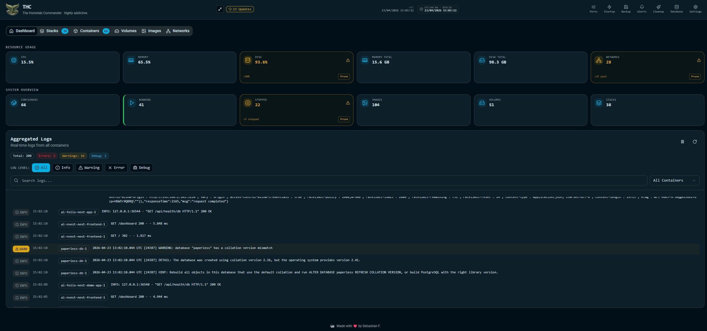
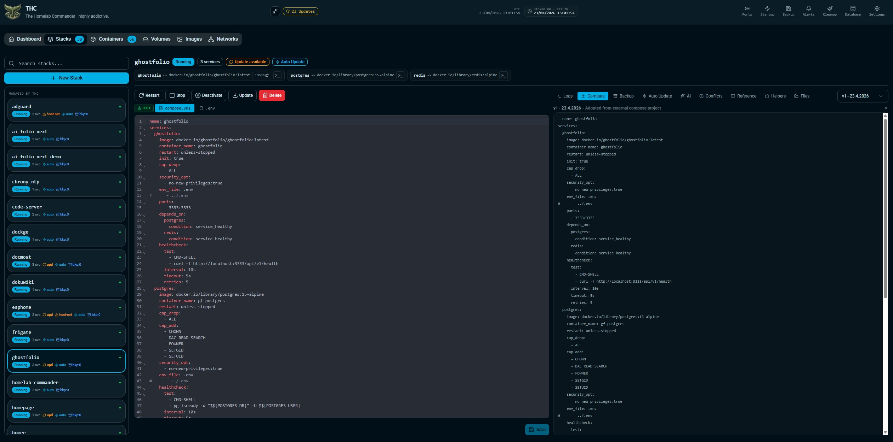
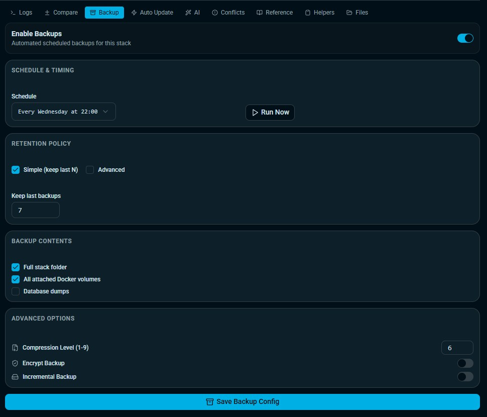
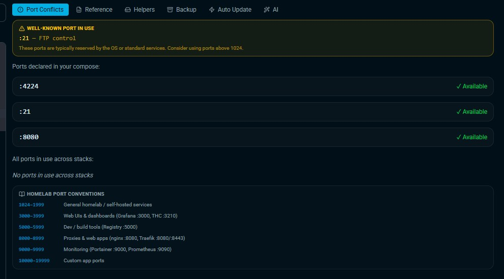
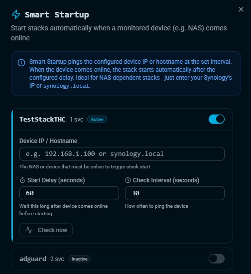
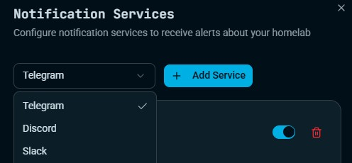
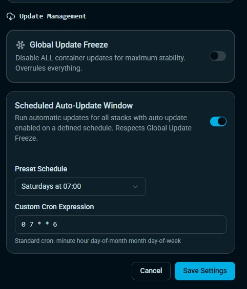
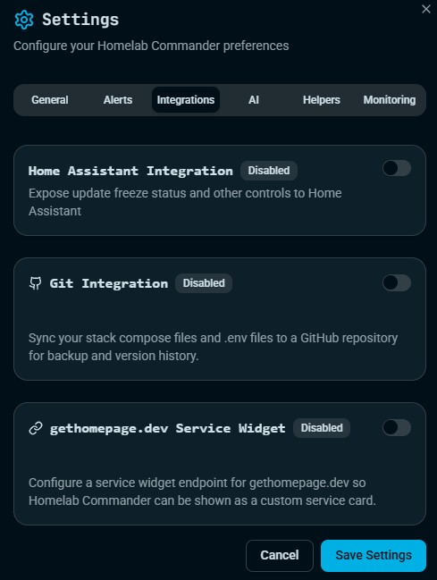
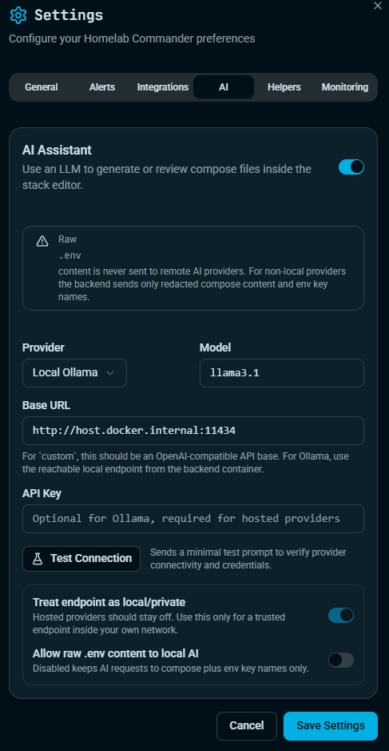
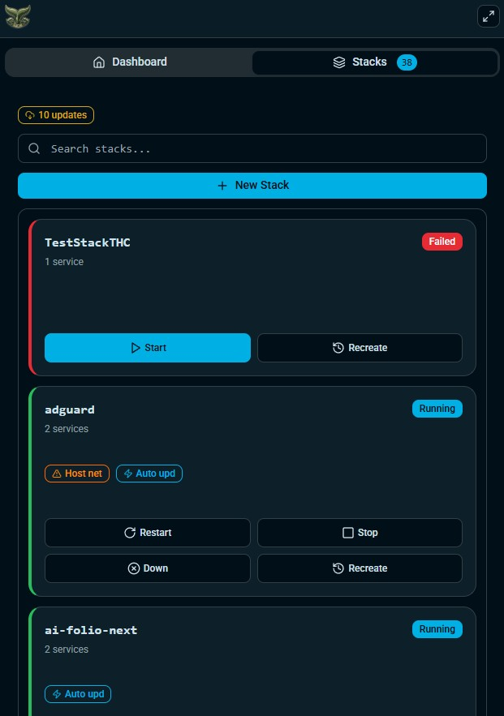

<p align="center">
  
</p>

<h1 align="center">The Homelab Commander</h1>
<p align="center"><strong>A self-hosted command center for Docker-powered homelabs.</strong></p>

<p align="center">
  
  
  
  
</p>

The Homelab Commander gives you one place to run your container infrastructure with confidence.

It combines day to day Docker operations, stack lifecycle tooling, backup automation, Smart Startup dependencies, update controls, and AI-assisted compose workflows into one fast dashboard built for operators who prefer direct control over abstraction.

## Why People Use It

- Single pane control for containers, images, volumes, networks, and compose stacks
- Real operational workflows: run, stop, restart, inspect, compare, back up, recover
- Backup and retention strategy built into stack management
- Smart Startup automation for dependency aware stack startup
- Optional AI compose generation and review, with secret aware redaction rules
- Git integration for stack repositories and change workflows
- Notification and monitoring integrations for production style homelab operations

## Core Features

### Container and Stack Operations
- Live Docker inventory with status and quick actions
- Integrated compose stack editor with version history and compare tools
- External compose project discovery
- Pull and redeploy update flow for stack images

### Backup and Recovery
- Stack backup policies per project
- Full stack folder backup support
- Attached volume backup support
- Database backup support for common stack databases
- Configurable retention and manual run-now operations

### Smart Startup
- Trigger stack start when monitored devices become available
- Adjustable check interval and start delay
- Device availability tracking in UI

### AI Compose Assistant
- Generate compose files from plain-language requirements
- Validate existing compose for errors and operational risks
- Provider support for local and hosted models
- Redaction-first handling for remote providers

### Integrations and Operations
- Notification services management
- Home Assistant integration
- Port registry and conflict visibility
- Global update freeze and scheduled auto update window


### Links
Smartphone View Enforced:
Compact Stacks:
http://localhost:3210/?mobile=1&tab=stacks
Compact Dashboard:
http://localhost:3210/?mobile=1&tab=dashboard
Full UI forced:
http://localhost:3210/?mobile=0&tab=stacks

## Visual Tour

### Main Dashboard


### Stack Editor


### Backup Management


### Port Conflict Detection


### Smart Startup


### Notifications


### Updates and Scheduling


### Integrations


### AI Assistant


### Compact / Small Screen UX


## Production Quick Start

### 1. Clone

```bash
git clone https://github.com/thesebastianf/homelab-commander.git
cd homelab-commander
```

### 2. Create Production Files From Examples

```bash
cp .env.example .env
cp docker-compose.yaml.example docker-compose.yaml
```

### 3. Configure Environment

Edit .env and set at minimum:
- POSTGRES_PASSWORD
- AUTH_USER and AUTH_PASS (recommended)
- Optional SEED values for first boot defaults

### 4. Start the Stack

```bash
docker compose -f docker-compose.yaml up -d
```

Open the UI at:
- http://localhost:3210

### Image Channels

- Stable (main): `:latest`
- Beta (beta branch): `:beta`

Switch channels by changing image lines in [docker-compose.yaml.example](docker-compose.yaml.example) before saving your `docker-compose.yaml`.

## Dev Machine Notes

- Local dev compose files are intentionally ignored by git:
  - `docker-compose.yml`
  - `docker-compose.dev.yml`
- Keep these for local development workflows only.

## GitHub Actions: Next Steps

1. Push the workflow and root Dockerfile to GitHub.
2. In repository settings, ensure GitHub Actions has permission to read/write packages.
3. Push to `beta` to publish beta images (`:beta`, `:sha-...`).
4. Push/merge to `main` to publish stable images (`:latest`, `:main`, `:sha-...`).
5. Confirm published images in GHCR:
  - `ghcr.io/thesebastianf/homelab-commander`

## Service Layout

- App: Node.js + Express + TypeScript serving React static build
- Database: PostgreSQL 16

## Security Notes

- Use strong credentials in .env
- Keep repository private if syncing sensitive stack files
- Review AI provider configuration before enabling hosted providers
- For remote AI providers, compose/env redaction is enforced by backend logic

## Repository Highlights

- Documentation: DOCUMENTATION.md
- Architecture: ARCHITECTURE.md
- Production compose example: docker-compose.yaml.example
- Backend source: backend/src
- Frontend source: frontend/src
- UI screenshots: 01_Dashboard.jpg through 10_Small_Screen_UX.jpg

## Roadmap Direction

Current beta focus:
- hardening Smart Startup and backup edge cases
- quality of life improvements in stack editor workflows
- richer observability and reporting
- expanded AI-assisted ops with strict safety defaults

## License

MIT
